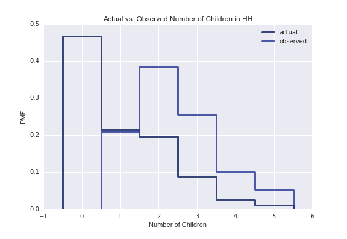

[Think Stats Chapter 3 Exercise 1](http://greenteapress.com/thinkstats2/html/thinkstats2004.html#toc31) (actual vs. biased)

>> <b>Prompt:</b> Something like the class size paradox appears if you survey children and ask how many children are in their family. Families with many children are more likely to appear in your sample, and families with no children have no chance to be in the sample.
<br>Use the NSFG respondent variable `NUMKDHH` to construct the actual distribution for the number of children under 18 in the household. Now compute the biased distribution we would see if we surveyed the children and asked them how many children under 18 (including themselves) are in their household. Plot the actual and biased distributions, and compute their means. 

>> <b>Answer:</b> The actual mean of number of children per household is `1.024`, compared to the biased/observed mean of `2.404` children per household. This discrepancy makes sense, since in households without any children, there are no children to collect observed data from, and therefore those households are not included in the observed data. 

Graph comparing actual vs. biased/observed PMFs:



Code using thinkstats modules: 
```python
import seaborn as sns
import numpy as np
import thinkstats2
import thinkplot
import matplotlib.pyplot as plt 
import chap01soln

# define function to calculate biased pmf from actual pmf; tatken from chap03ex.ipynb
def BiasPmf(pmf, label=''): 
    new_pmf = pmf.Copy(label=label)

    for x, p in pmf.Items():
        new_pmf.Mult(x, x)
        
    new_pmf.Normalize()
    return new_pmf

# load df and calculate actual and observed pmfs
resp = chap01soln.ReadFemResp()
actual_pmf = thinkstats2.Pmf(resp.numkdhh, label='actual')
biased_pmf = BiasPmf(actual_pmf, label='observed')

# plotting
thinkplot.Pmfs([actual_pmf, biased_pmf]) 
plt.xlabel('Number of Children')
plt.ylabel('PMF')
plt.legend()
plt.title('Actual vs. Observed Number of Children in HH')
plt.savefig('../../dsp/img/ch3ex.jpg')
plt.show()

# calculate and print means
actualMean = actual_pmf.Mean() 
observedMean = biased_pmf.Mean()
print 'Actual mean:', actualMean
print 'Observed/biased mean:', observedMean
```

Alternate code without thinkstats:
```python
# attempted to do some parts of this without thinkstats modules

# plot pmf using matplotlib
plthist = plt.hist(resp.numkdhh, bins=np.arange(0,7,1), align='left', normed = True) 
plt.legend(('num children in hh',))
plt.show()

#calculate pmf mean 
hist = {}
for x in resp.numkdhh:
    hist[x] = hist.get(x, 0) + 1

n = float(sum(hist.values()))
manual_pmf = {}
for x, freq in hist.items():
    manual_pmf[x] = freq / n 

def pmfmean(dict):
    mean = 0.0
    for x, p in dict.items():
        mean += p * x
    return mean

print pmfmean(manual_pmf)
```