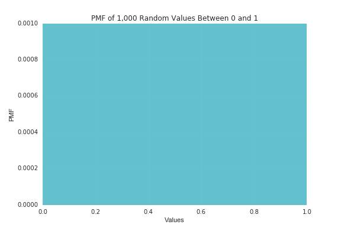
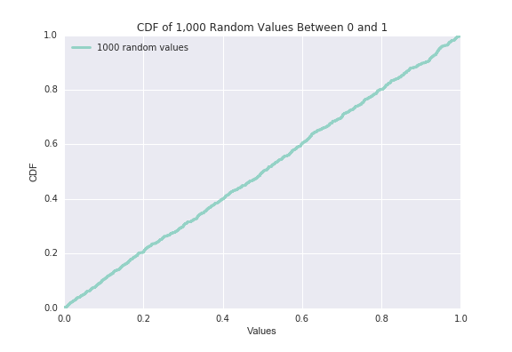

[Think Stats Chapter 4 Exercise 2](http://greenteapress.com/thinkstats2/html/thinkstats2005.html#toc41) (a random distribution)

>> <b>Prompt:</b> The numbers generated by `random.random` are supposed to be uniform between 0 and 1; that is, every value in the range should have the same probability. Generate 1000 numbers from `random.random` and plot their PMF and CDF. Is the distribution uniform?

>> <b>Answer:</b> Yes, the distribution is uniform. 

To begin, I generated a list of 1,000 random values between 0 and 1. 

```python
import thinkstats2
import thinkplot
import matplotlib.pyplot as plt
import random
vals = [random.random() for x in range(1000)] 
```

<b>Probability mass function</b>

I plotted the probability mass function of the list of random numbers. If the distribution of our selected numbers is uniform, the probability of each value should be `1 / 1000`, or `0.0010`--all bars in the graph will be of equal height at `0.0010`.

```python
rand_pmf = thinkstats2.Pmf(vals, label='1000 random values')
thinkplot.Pmf(rand_pmf)
plt.xlabel('Values')
plt.ylabel('PMF')
plt.title('PMF of 1,000 Random Values Between 0 and 1')
plt.savefig('../../dsp/img/ch4ex_pmf.png')
plt.show()
```

Resulting PMF chart:



The result shows that the distribution is uniform -- since the density of bars is so high and all 1,000 values have the same probability of `0.0010`, the entire chart gets abstracted into a shaded rectangle. Even though the PMF chart result hints that the random values are uniformly distributed, it's not a very readable chart. 

<b>Cumulative distribution function</b>

Using a CDF is a better way to investigate the uniformity of random numbers. If we plot values against CDF, it should return a straight line if the distribution is uniform since each value should be mapped 1-to-1 with its percentile rank. 

```python
rand_cdf = thinkstats2.Cdf(vals, label='1000 random values')
thinkplot.Cdf(rand_cdf)
plt.legend(loc=2)
plt.ylabel('CDF')
plt.xlabel('Values')
plt.title('CDF of 1,000 Random Values Between 0 and 1')
plt.savefig('../../dsp/img/ch4ex_cdf.png')
plt.show()
```

Resulting CDF chart: 



As we can see, the plot of CDF is a straight line, so the distribution is indeed uniform. 


