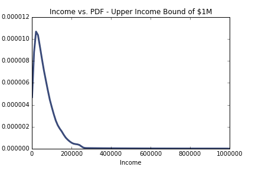
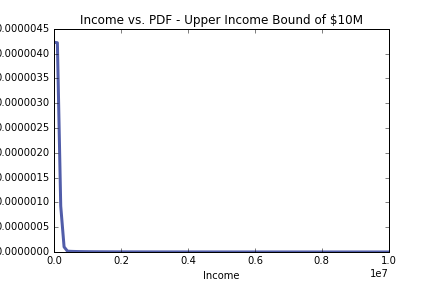

[Think Stats Chapter 6 Exercise 1](http://greenteapress.com/thinkstats2/html/thinkstats2007.html#toc60) (household income)

>> <b>Prompt:</b> Using a dataset containing income ranges and the number of respondents in each range, generate a sample mirroring the dataset and compute the median, mean, skewness and Pearson's skewness of the sample. What fraction of households reports a taxable income below the mean? How do the results depend on the assumed upper bound?

>> <b>Answer:</b> Assuming an upper bound income of $1,000,000 and $10,000,000 for the two scenarios: 

>> Statstic | Upper bound = $1M | Upper bound = $10M
----- | ----- | -----
Mean | $74,279 | $124,267
Median | $51,226 | $51,226
Sample skewness | 4.95 | 11.60
Pearson's skewness | 0.74 | 0.39
Pct. of households under mean | 66.0% | 85.7%

>>The higher the upper bound, the more positively or right skewed the distribution is. 

To begin, I loaded the income dataset using the `ReadData()` function built into the `hinc` module of TS2. 

```python
import hinc
import hinc2
import pandas as pd
import matplotlib.pyplot as plt
import numpy as np
import thinkstats2
import thinkplot
import scipy

inc = hinc.ReadData() # use built in TS2 script to read csv
```

Following the suggestion in TS2, I created a function that would generate a sample of incomes (`samp`) that mirrored characteristics of the dataset. Because the lower and upper bounds are not defined in the dataset, I set a low bound of $1,000 and a high bound of $1,000,000. 

```python
def interpolate(data, highestLog):
    data['logupper'] = np.log10(data['income']) # set log10 income of higher bound
    data['loglower'] = data.logupper.shift(1) # set log10 income of lower bound
    data.loglower[0] = 3.0 # set lowest income bound to $1k
    data.logupper[41] = highestLog # set highest income bound to given log as defined in function call

    # generate array containing sample log values
    logArray = []
    for i, row in data.iterrows(): # iterates through index and series for each row
        vals = np.linspace(row.loglower, row.logupper, row.freq) # generates set of values for each inc band based on hi, low, and freq
        logArray.append(vals)

    logsamp = np.concatenate(logArray) # combine arrays into one
    incsamp = np.power(10, logsamp) # convert logs into sample incomes
    return incsamp

samp = interpolate(inc, 6.0)
```

I then defined a function to return summary stats of the sample. 

```python
def summary(samp): # calculate summary stats
    
    def pSkew(mu, med, sigma):
        p = 3 * (mu - med) / sigma
        return p

    Cdf = thinkstats2.Cdf(samp)

    mean = samp.mean()
    print 'Mean:', mean

    median = incCdf.Value(0.5) # use Cdf to generate median 
    print 'Median:', median

    standard_dev = samp.std()
    print 'Std deviation:', standard_dev

    skew = scipy.stats.skew(samp)
    print 'Sample skewness:', skew

    Pearsons = pSkew(mean, median, standard_dev)
    print 'Pearsons skewness:', Pearsons
    
    pctUnderMean = Cdf.Prob(mean)
    print 'Percent hh with income under mean:', pctUnderMean * 100

summary(samp)
```

To investigate the impacts of using a higher income bound, I reran the analysis using $10M as the upper limit (`highestLog = 7.0` in the `interpolate` function). The resulting summary statistics show that the mean is much higher than the median, indicating greater skewness (although the Pearson's skewness actually returns a smaller result...). I also plotted the PDFs of the two income bounds to see the visual representation of this. 

```python
# plot PDF of upper bound = $1M
sampPdf = thinkstats2.EstimatedPdf(samp, label='Upper bound: $1M')
thinkplot.Pdf(sampCdf)
plt.title('Income vs. PDF - Upper Income Bound of $1M')
plt.xlabel('Income')
plt.ylabel('PDF')
plt.savefig('../../dsp/img/ex6_pdf_1M.png')

# plot PDF of upper bound = $10M
sampHigherPdf = thinkstats2.EstimatedPdf(samp_higher, label = 'Upper bound: $10M')
thinkplot.Pdf(sampHigherPdf)
plt.title('Income vs. PDF - Upper Income Bound of $10M')
plt.xlabel('Income')
plt.ylabel('PDF')
plt.savefig('../../dsp/img/ex6_pdf_10M.png')
```



