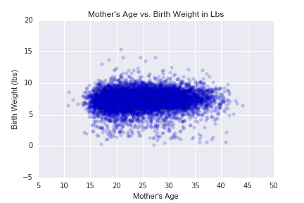
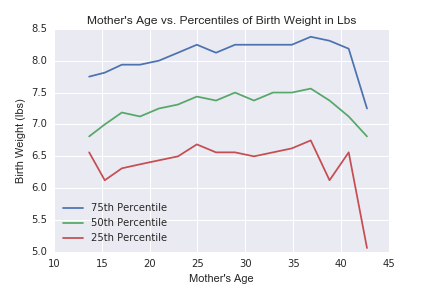

[Think Stats Chapter 7 Exercise 1](http://greenteapress.com/thinkstats2/html/thinkstats2008.html#toc70) (weight vs. age)

>> <b>Prompt:</b> Using data from the NSFG, make a scatter plot of birth weight versus mother’s age. Plot percentiles of birth weight versus mother’s age. Compute Pearson’s and Spearman’s correlations. How would you characterize the relationship between these variables?

>> <b>Answer:</b> Pearson's correlation for birth weight vs. mother's age is 0.069 and Spearman's correlation is 0.095. These statistics indicate that there is a very slight positive correlation between the two variables (i.e. as mother's age is greater, birth weight is greater). The scatter plot affirms the magnitude of the correlation as minimal, as there is no distinct pattern in the chart. The plot of mother's age vs. percentiles shows the pattern of the positive correlation, with slightly higher birth weights as the mother's age increases.  

>> The fact that Spearman's correlation is slightly higher indicates that the minimal correlation between weight and mother's age is not linear, or that there are outliers in the data. 

Process: 

To start, I imported the necessary TS2 modules and parsed the data for weight and age, selecting only live births and dropping NA/NAN values. 

```python
%matplotlib inline

import nsfg
import math
import thinkstats2
import thinkplot
import matplotlib.pyplot as plt
import seaborn as sns
import numpy as np
import pandas as pd

preg = nsfg.ReadFemPreg()
live = preg[preg.outcome == 1] # select only live births
live = live.dropna(subset = ['agepreg', 'totalwgt_lb']) # drops na values
wgt = live.totalwgt_lb 
age = live.agepreg
```

Then I created a scatter plot of mother's age vs. birth weight.

```python
plt.scatter(age, wgt, alpha = 0.2)
plt.xlabel('Mother\'s Age')
plt.ylabel('Birth Weight (lbs)')
plt.title('Mother\'s Age vs. Birth Weight in Lbs')
plt.savefig('../../dsp/img/ch7scatter.png')
plt.show()
```



To plot mother's age vs. percentiles of birth weight, I binned mother's age in intervals of 2 years, indexed the ages to the bins, grouped the birth weight data by the age indicies, and calulated the mean age and percentiles of weight for each index. Then I plotted the 25th, 50th, and 75th percentiles for birth weights against each age index. 

```python
bins = np.arange(10, 50, 2) # bin age data between 10 yrs and 50 yrs, with interval of 2 yrs
indices = np.digitize(age, bins) # index age data to age bins
groups = live.groupby(indices) # group by age indices

ages = [group.agepreg.mean() for i, group in groups][1:-1] # calculate mean age in each age index
cdfs = [thinkstats2.Cdf(group.totalwgt_lb) for i, group in groups][1:-1] # create cdf of birth weight data for each age index

# plot each percentile
for percent in [75, 50, 25]:
    weights = [cdf.Percentile(percent) for cdf in cdfs]
    label = '%dth Percentile' % percent
    plt.plot(ages, weights, label=label)
    plt.xlabel('Mother\'s Age')
    plt.ylabel('Birth Weight (lbs)')
    plt.title('Mother\'s Age vs. Percentiles of Birth Weight in Lbs')
    plt.legend(loc=3)
    plt.savefig('../../dsp/img/ch7scatter_pct.png')
```



Then I computed Pearson's and Spearman's correlation. 

```python
# compute Pearson's correlation
p_corr = thinkstats2.Corr(age, wgt)

# compute Spearman's correlation
s_corr = thinkstats2.SpearmanCorr(age, wgt)

# print results
print 'Pearsons correlation:', p_corr
print 'Spearmans correlation:', s_corr
```
