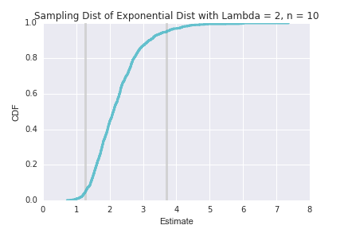
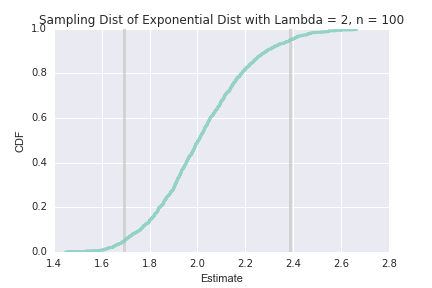
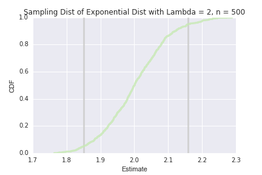
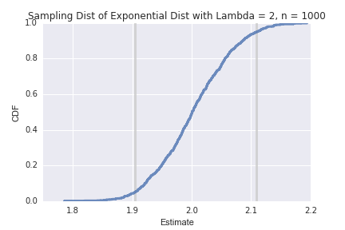
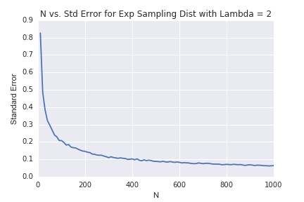

[Think Stats Chapter 8 Exercise 2](http://greenteapress.com/thinkstats2/html/thinkstats2009.html#toc77) (scoring)

>> **Prompt:** Suppose you draw a sample with size `n = 10` from an exponential distribution with `λ = 2`. Simulate this experiment 1000 times and plot the sampling distribution of the estimate `L`. Compute the standard error of the estimate and the 90% confidence interval. Repeat the experiment with a few different values of n and make a plot of standard error versus `n`.

>> **Answer:**  
As `n` gets bigger, the standard error decreases and the CI becomes narrower. 

>> Statistic | n = 10 | n = 100 | n = 500 | n = 1000
---- | ---- | ---- | ---- | ----
Standard Error | 0.80 | 0.21 | 0.09 | 0.06
90% CI | 1.27, 3.71 | 1.69, 2.39 | 1.85, 2.16 | 1.90, 2.11
Plot |  |  |  |  

>>  

Process: 

I modified the `SimulateSample` function provided in TS2 to create a sampling distribution of an exponential distrubtion given `lam` = lambda, `n` = sample size, `m` = number of times the experiment is run, and `pr` and `pl` parameters to turn printing and plotting on/off. The function returns the standard error. 

```python
import thinkstats2
import thinkplot
import math
import random
import numpy as np
import estimation
import seaborn as sns
import matplotlib.pyplot as plt
%matplotlib inline

def sampDist(lam, n, m, pr=True, pl=True):

    estimates = []
    for _ in range(m):
        xs = np.random.exponential(1.0/lam, n) # draw sample of n size from exp dist with scale = 1/lambda
        L = 1 / np.mean(xs) # calculate mean of dist
        estimates.append(L)

    cdf = thinkstats2.Cdf(estimates)
    ci = cdf.Percentile(5), cdf.Percentile(95)
    stderr = estimation.RMSE(estimates, lam)
    
    if pr: # prints if pr parameter is set to True
        print 'Confidence Interval:', ci
        print 'Standard Error:', stderr 

    # plot the CDF
    def VertLine(x, y=1): # draws vertical line for confidence int
        thinkplot.Plot([x, x], [0, y], color='0.8', linewidth=3)
        
    if pl: # plots if pr parameter is set to True
        VertLine(ci[0])
        VertLine(ci[1])
        thinkplot.Cdf(cdf)
        plt.xlabel('Estimate')
        plt.ylabel('CDF')
        plt.title('Sampling Dist of Exponential Dist with Lambda = 2, n = %d' %n)
        plt.savefig('../../dsp/img/ch8ex2_n%d.png' %n)
        plt.show()
    
    return stderr
```

I ran the function a few times with different values of `n` --  10, 100, 500, 1,000 -- to observe differences in behavior. 

```python
sampDist(2, 10, 1000, True, True)
```

To create a more robust dataset of `n` vs. standard error, I created a longer list of 100 values of `n` between 10 and 1,000, iterated through the list and ran the `sampDist` function, and plotted the results. 

```python
# plot N vs. standard error
nsForPlotting = np.linspace(10, 1000, 100)

stderrs = []
for n in nsForPlotting:
    stderr = sampDist(2, n, 1000, False, False)
    stderrs.append(stderr)
    
plt.plot(nsForPlotting, stderrs)
plt.xlabel('N')
plt.ylabel('Standard Error')
plt.title('N vs. Std Error for Exp Sampling Dist with Lambda = 2')
plt.savefig('../../dsp/img/ch8ex2_nvstderr.png')
plt.show()
```


