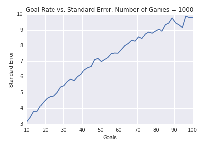

[Think Stats Chapter 8 Exercise 3](http://greenteapress.com/thinkstats2/html/thinkstats2009.html#toc77)

---

>> **Prompt:** In games like hockey and soccer, the time between goals is roughly exponential. So you could estimate a team’s goal-scoring rate by observing the number of goals they score in a game. Write a function that takes a goal-scoring rate, `lam`, in goals per game, and simulates a game by generating the time between goals until the total time exceeds 1 game, then returns the number of goals scored.  
Write another function that simulates many games, stores the estimates of `lam`, then computes their mean error and RMSE.  
Is this way of making an estimate biased? Plot the sampling distribution of the estimates and the 90% confidence interval. What is the standard error? What happens to sampling error for increasing values of `lam`?

>> **Answer**: For my sampling distribution with a goal-scoring rate of 10 (I used `rate` instead of `lam` and a simulated number of games of 10,000 (`numGames`)), the RMSE/standard error was 3.19 and the mean error was 0.05. 


If an estimator is unbiased, the mean error should approach zero as the number of repetitions increases. To investigate this, I simulated the game between 100 and 1,000 game repetitions and plotted the mean error. As the graph below shows, this way of making an estimate is not biased, since the mean error approaches zero as the number of game simulations increases. 


To investigate what happens to sampling/standard error as the goal-scoring rate increases, I followed the same approach, calculating standard error for a range of goal-scoring rates between 10 and 100. As the chart below shows, as the goal-scoring rate increases, the standard error increases. This makes sense--as the number of target goals grows, the greater the number of random `timeOfGoals` (or time between goals) gets taken, errors accumulate, and the greater the chances are of getting a `numGoals` (estimated total number of goals scored) that deviates from the actual rate. To reduce sampling error using this simulator, one should increase the number of games simulated as the goal rate increases. 



**Process:**

I wrote a function `game()` to simulate one instance of the game with a given `rate` (goal-scoring rate, or `lam`). Then I wrote a function `gamesSim()` to simulate multiple games (`numGames`) given a rate. `gamesStats` calculates the standard and mean error statistics (with the option to print), and `gamesPlot` plots the sampling distribution with the 90% CI. 

```python
def game(rate):
    time = 0
    numGoals = 0
    while True:
        timeOfGoal = random.expovariate(rate) # simulate scoring of goal and generate time of goal
        time += timeOfGoal # add time of goal to time tracker
        if time > 1:
            break
        numGoals += 1 # add goal to goal tracker only if it's scored within game
    return numGoals

def gamesSim(numGames, rate):
    # simulates a given number of games m times and stores the goals/scores of each
    goalEstimates = []
    for _ in range(numGames):
        numGoals = game(rate)
        goalEstimates.append(numGoals)
    return goalEstimates

def gamesStats(goalEstimates, rate, pr=True):
    # calculates std err and mean error based on game simulation, returns std err and mean error as tuple
    rmse = estimation.RMSE(goalEstimates, rate)
    meanErr = estimation.MeanError(goalEstimates, rate)
    if pr:
        print 'RMSE/Standard Error:', rmse
        print 'Mean Error:', meanErr
    return rmse, meanErr

def gamesPlot(goalEstimates, rate, numGames):
    # plots games simulation
    gamescdf = thinkstats2.Cdf(goalEstimates)
    ci = gamescdf.Percentile(5), gamescdf.Percentile(95)
    
    def VertLine(x, y=1): # draws vertical line for confidence int
        thinkplot.Plot([x, x], [0, y], color='0.8', linewidth=3)

    VertLine(ci[0])
    VertLine(ci[1])
    thinkplot.Cdf(gamescdf)
    plt.xlabel('Goals Estimate')
    plt.ylabel('CDF')
    plt.title('Sampling Dist of Game with Goals = %d, Number of Games = %d' %(rate, numGames))
    plt.savefig('../../dsp/img/ch8ex3.png')
    plt.show()
```

To investigate **sampling error for increasing goal-scoring rates**, I plotted standard error vs. goal-scoring rates for a sample set of rates between 10 and 100. 

```python
# create set of increasing values for lam/goals rate
rates = np.linspace(10, 100, 50) 

# calculate standard errors for goals rates
goalserrs = []
for r in rates:
    goals = gamesSim(1000, r)
    goalserr = gamesStats(goals, r, pr=False)
    goalserrs.append(goalserr[0]) # append only std err

# plot 
plt.plot(rates, goalserrs)
plt.xlabel('Goals')
plt.ylabel('Standard Error')
plt.title('Goal Rate vs. Standard Error, Number of Games = 1000')
plt.savefig('../../dsp/img/ch8ex3_stderr.png')
plt.show()
```

To investigate if the **estimator was biased**, I plotted mean error agaist number of simulated games for a sample set between 100 and 10,000 games. 

```python
numgames_test = np.linspace(100, 10000, 100) # create sample set of games to be simulated

mean_errs = []
for g in numgames_test:
    goals = gamesSim(int(g), rate=10)
    goalserr = gamesStats(goals, rate=10, pr=False)
    mean_errs.append(goalserr[1]) # append only mean err

# plot 
plt.plot(numgames_test, mean_errs)
plt.xlabel('Number of Games')
plt.ylabel('Mean Error')
plt.title('Number of Games vs. Mean Error, Goal Rate = 10')
plt.savefig('../../dsp/img/ch8ex3_meanerr.png')
plt.show()   
```
---